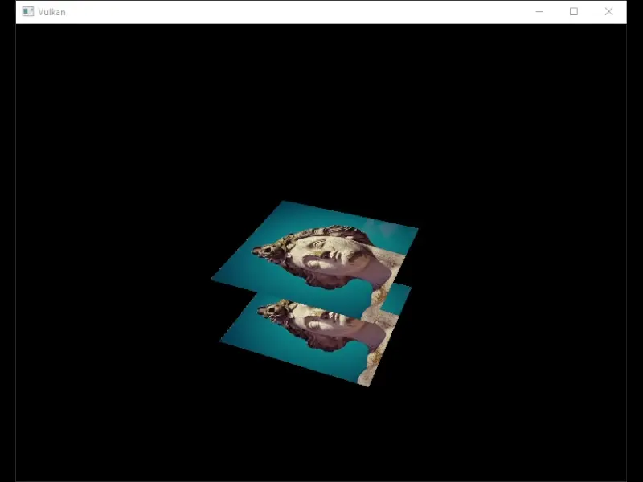

## Lustrous Engine

This is the Lustrous Engine Repository, an application that utilizes the Vulkan API to
render images. The initial development was created using the [Vulkan Tutorial](https://github.com/Overv/VulkanTutorial) by [Overv](https://github.com/Overv).

#

The program creates renders an rectangle with an applied texture. This is a rudimentary demonstration
for the Vulkan API. The program currently initializes the API and only implements the required functions 
to perform the render.

This application is currently in development and its purpose is for me to learn graphics API and the graphics pipeline. Vulkan 
is used for its cross-compatibility and feature support/control.

Further updates to this application includes suppoprt for: 
- Lighting
- Shadows
- Mipmaps
- Model Loading
- And more
